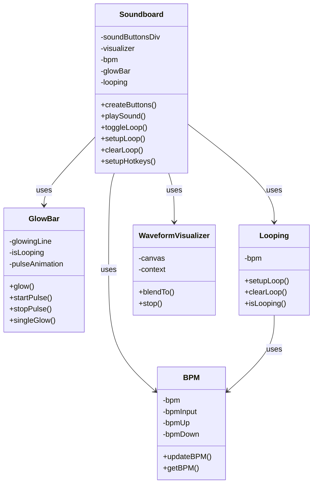
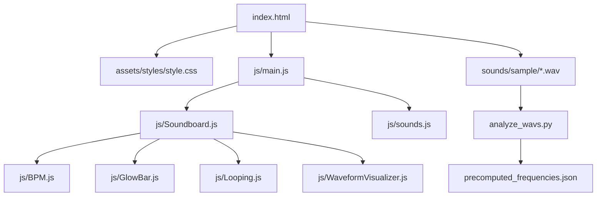
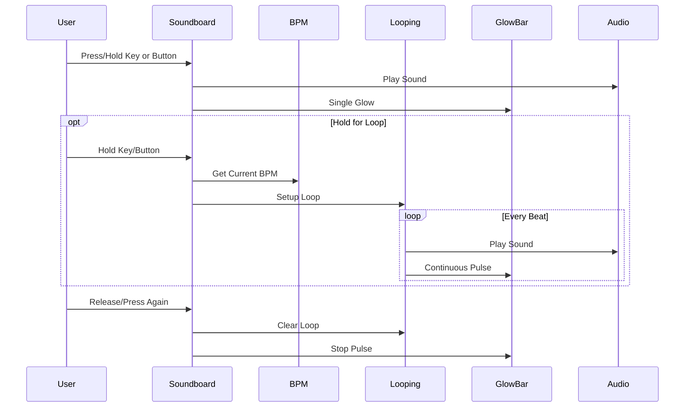

# Soundboard Architecture

## Component Overview

## File Structure

## Data Flow

## Key Features

1. **Sound Playback**
   - Single-hit playback with visual feedback
   - Loop creation by holding keys/buttons
   - Multiple sounds can play simultaneously

2. **Visual Feedback**
   - Glow bar pulses with the beat
   - Fill animation when holding for loop
   - Button scaling and color changes
   - Waveform visualization

3. **BPM Control**
   - Adjustable tempo with up/down controls
   - Visual feedback on BPM changes
   - Affects loop timing

4. **User Interface**
   - Keyboard shortcuts for all sounds
   - Visual button grid
   - Hold-to-loop mechanism
   - Clear visual state indicators

## Sound Processing

The system uses precomputed frequency data for visualization, generated by `analyze_wavs.py`. This data is stored in `precomputed_frequencies.json` and used by the WaveformVisualizer for real-time display.

## Event Flow

1. **Button/Key Press:**
   - Play sound immediately
   - Start fill animation
   - Show single glow effect

2. **Hold Detection:**
   - Track hold duration
   - Show fill progress
   - Trigger loop at threshold

3. **Loop Active:**
   - Play sound at BPM intervals
   - Maintain continuous glow effect
   - Scale and highlight active button

4. **Loop End:**
   - Clear intervals
   - Reset visual states
   - Stop glow effects
