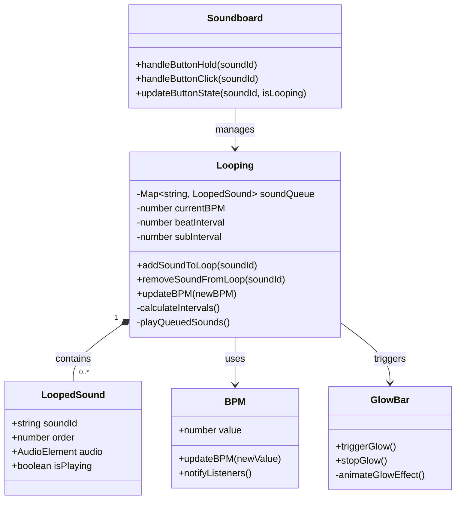
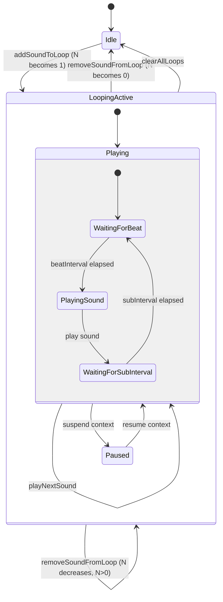

# Multiple Looping Feature Plan

This document outlines the plan to implement a multiple looping mechanism for the Soundboard project.

## 1. Active JavaScript Files

Based on the `index.html` script import (`<script type="module" src="./src/main.js"></script>`), the relevant JavaScript files for this feature are located in the `src/` directory:

*   `src/main.js`
*   `src/audio/Looping.js`
*   `src/ui/Soundboard.js`
*   `src/visualizers/GlowBar.js`
*   `src/ui/BPM.js`

## 2. Phased Implementation Plan

### Phase 1: Information Gathering & Understanding Existing Code (Completed)

*   **Identified Active JavaScript Files:** All relevant files are within the `src/` directory.
*   **Core Components to Analyze (Next Steps for Implementation):**
    *   `src/audio/Looping.js`: Current loop logic, timing, and data storage.
    *   `src/ui/Soundboard.js`: Sound playback and interaction with `Looping.js`.
    *   `src/visualizers/GlowBar.js`: Glow triggering and synchronization.
    *   `src/ui/BPM.js`: BPM management.

### Phase 2: Designing the New Multiple Looping System

#### a. Data Structures

*   `src/audio/Looping.js` will manage a list/queue for looped sounds. Each item in the queue will contain:
    *   `soundId`: A unique identifier for the sound.
    *   `order`: A sequence number (0 for the first sound added, 1 for the second, etc.). This determines playback order and glow priority.
    *   A reference to the audio element or its playback function.

#### b. Timing and Scheduling

*   Let `N` be the number of sounds currently in the loop.
*   The time for one full beat is `beatInterval = 60 / currentBPM` (seconds).
*   Each sound in the multi-loop will play within a fraction of this beat: `subInterval = beatInterval / N`.
*   A main timer (e.g., `setInterval` or a `requestAnimationFrame` loop) will manage the overall beat. Within each `beatInterval`, it will cycle through playing the `N` sounds, each spaced by `subInterval`.
    *   **Example:** If 2 sounds (S1, S2) are looped and `beatInterval` is 1 second:
        *   T=0.0s: S1 (order 0) plays + Glow.
        *   T=0.5s: S2 (order 1) plays (no glow).
        *   T=1.0s: S1 (order 0) plays + Glow (start of next beat).
        *   T=1.5s: S2 (order 1) plays (no glow).
        *   And so on.

#### c. Managing the Loop Queue

*   **Adding Sounds:**
    *   When a user initiates a loop for a sound:
        *   If no multi-loop is active, a new one starts with this sound (assigned `order = 0`).
        *   If a multi-loop is already active, the new sound is added to the end of the queue with `order = N` (where N is the current size before adding).
*   **Removing Sounds:**
    *   Clicking an already looped sound (or its corresponding key) will remove only that specific sound from the multi-loop queue.
    *   If the removed sound was the last one in the queue (`N` becomes 0), the multi-loop stops.
    *   The `order` of subsequent sounds in the queue will need to be updated (e.g., if sound at order 1 is removed, sound at order 2 becomes order 1).
*   The number of sounds `N` and the `subInterval` must be recalculated whenever sounds are added or removed.

#### d. Glow Logic Update

*   When `src/audio/Looping.js` plays a sound as part of the multi-loop sequence, it will check the `order` of that sound.
*   If `order === 0` (i.e., it's the first sound that was added to the current multi-loop), `Looping.js` will instruct `src/visualizers/GlowBar.js` to trigger the glow effect.
*   For all other sounds in the sequence (`order > 0`), no glow will be triggered.

### Phase 3: High-Level Implementation Plan (File-Specific)

*   **`src/audio/Looping.js` (Major Changes):**
    *   Implement the ordered queue/list for looped sounds.
    *   Rewrite timing logic to handle `subInterval` playback for multiple sounds.
    *   Manage adding sounds to the queue and assigning their `order`.
    *   Manage removing specific sounds from the queue and re-indexing `order` if necessary.
    *   Recalculate `N` (number of looped sounds) and `subInterval` upon changes.
    *   Implement logic to signal `src/visualizers/GlowBar.js` for the priority sound's glow.
*   **`src/ui/Soundboard.js` (Moderate Changes):**
    *   Update event handlers (button holds/clicks, key presses) to correctly call the new methods in `src/audio/Looping.js` for adding/removing sounds from the multi-loop.
    *   Ensure UI elements (e.g., button states) reflect whether a sound is part of the multi-loop.
*   **`src/visualizers/GlowBar.js` (Minor to Moderate Changes):**
    *   Modify existing glow methods (or add new ones) to be triggered by `src/audio/Looping.js` only when the priority sound plays. Ensure it doesn't glow for non-priority sounds in the multi-loop.
*   **`src/ui/BPM.js` (Potentially Minor Changes):**
    *   Ensure `src/audio/Looping.js` can reliably get the current BPM whenever it needs to recalculate `beatInterval`.

## 3. Diagrams

### Component Sequence Diagram

```mermaid
sequenceDiagram
    participant User
    participant SoundboardUI (index.html, src/ui/Soundboard.js)
    participant LoopingManager (src/audio/Looping.js)
    participant BPMManager (src/ui/BPM.js)
    participant AudioManager (Audio elements, src/ui/Soundboard.js playSound)
    participant GlowBar (src/visualizers/GlowBar.js)

    %% Adding a sound to the loop
    User->>SoundboardUI: Hold Button (SoundX)
    SoundboardUI->>LoopingManager: addSoundToLoop(SoundX)
    LoopingManager->>BPMManager: getCurrentBPM()
    BPMManager-->>LoopingManager: bpmValue
    LoopingManager->>LoopingManager: Stores SoundX with its order
    LoopingManager->>LoopingManager: Recalculates N and subInterval
    
    %% Loop playback cycle
    loop Every beatInterval
        LoopingManager->>LoopingManager: For each sound in queue
        alt Sound has order=0
            LoopingManager->>AudioManager: playSound(SoundX)
            LoopingManager->>GlowBar: triggerGlow()
            GlowBar-->>SoundboardUI: Visual feedback
        else Sound has order>0
            LoopingManager->>AudioManager: playSound(SoundY)
        end
    end

    %% BPM change handling
    User->>BPMManager: Change BPM
    BPMManager->>LoopingManager: notifyBPMChange(newBPM)
    LoopingManager->>LoopingManager: Recalculate intervals
    
    %% Removing a sound
    User->>SoundboardUI: Click looping sound
    SoundboardUI->>LoopingManager: removeSoundFromLoop(SoundX)
    LoopingManager->>LoopingManager: Remove sound & reindex orders
    LoopingManager->>LoopingManager: Recalculate N and subInterval
    alt No sounds left (N=0)
        LoopingManager->>GlowBar: stopGlowEffect()
        LoopingManager->>LoopingManager: Stop loop cycle
    end
```

### Class Diagram



### State Diagram


